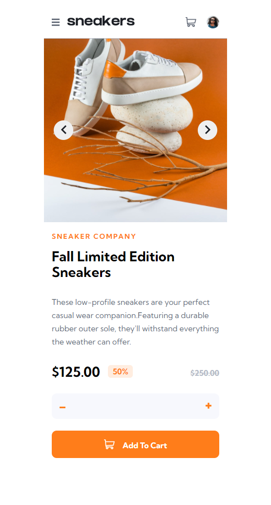
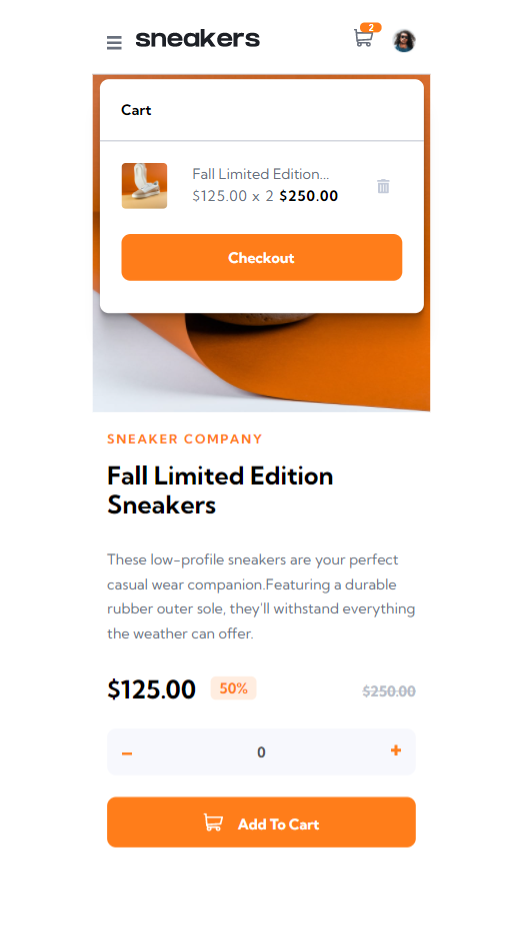
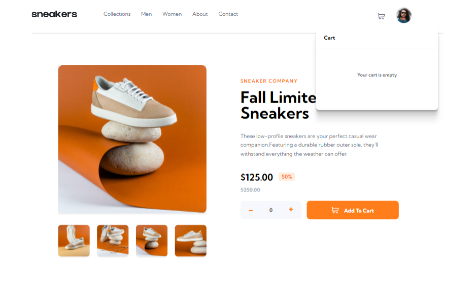
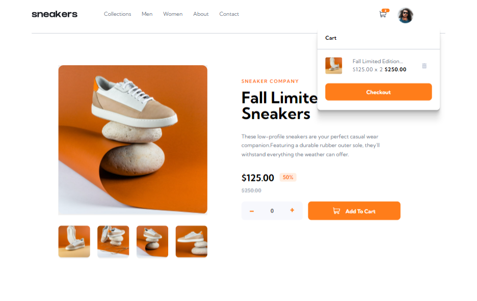

# Frontend Mentor - E-commerce product page solution

This is a solution to the [E-commerce product page challenge on Frontend Mentor](https://www.frontendmentor.io/challenges/ecommerce-product-page-UPsZ9MJp6).

## Table of contents

- [Overview](#overview)
  - [The challenge](#the-challenge)
  - [Screenshot](#screenshot)
  - [Links](#links)
- [My process](#my-process)
  - [Built with](#built-with)
  - [What I learned](#what-i-learned)
  - [Continued development](#continued-development)
  - [Useful resources](#useful-resources)
- [Author](#author)
- [Acknowledgments](#acknowledgments)

## Overview
This app was built to the following screen widths : 
- 1440px - Desktop
- 375px - Mobile
                                                    
### The challenge

Users should be able to:

- View the optimal layout for the site depending on their device's screen size
- See hover states for all interactive elements on the page
- Open a lightbox gallery by clicking on the large product image
- Switch the large product image by clicking on the small thumbnail images
- Add items to the cart
- View the cart and remove items from it

## Screenshot

## Link

Live site : https://jibolacodes-sneakers-product-page.netlify.app/
Solution site : http://surl.li/bdcvb

## My process

### Built with

- Semantic HTML5 markup
- CSS custom properties
- Flexbox
- CSS Grid
- Mobile-first workflow
- [React](https://reactjs.org/) - JS library

### What I learned

I learned how to use the React hooks : useState, useRef, useEffect, prop drilling and call back functions

### Useful resources

- (https://www.w3schools.com/react/) - This helped me in learning useState, useEffect and useRef hooks.

## Author

- Frontend Mentor - [@jibolacodes](https://www.frontendmentor.io/profile/jibolacodes)
- Twitter - [@jibolacodes](https://www.twitter.com/yourusername)

